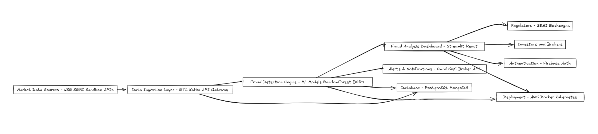

# 🛡️ FraudShield AI – Intelligent Market Fraud Detection System

FraudShield AI is an **AI-powered fraud detection platform** built to protect securities markets from malicious activities.  
It analyzes real-time trading data, applies advanced machine learning models, and generates **early fraud alerts** to enhance **investor safety, compliance, and market trust**.  

---

## 🚀 Features
- **Real-time Market Data Ingestion** from NSE, SEBI Sandbox, and broker feeds  
- **Machine Learning Engine** for anomaly detection (scikit-learn, Hugging Face transformers)  
- **Fraud Pattern Detection** – insider trading, spoofing, pump-and-dump, wash trades  
- **Interactive Dashboard** for regulators and brokers (React + FastAPI + PostgreSQL)  
- **Automated Alerts & Reports** with actionable insights  
- **Cloud-Native & Scalable** using AWS, Docker, Kubernetes  

---

## 📸 Architecture



---

## 🛠️ Tech Stack
- **Frontend/UI:** Streamlit (Python)  
- **Backend:** FastAPI (Python)  
- **ML Models:** scikit-learn, Hugging Face  
- **Database:** PostgreSQL (optional for production)  
- **Infra:** AWS, Docker, Kubernetes

---

## 📂 Project Structure
```
fraudshield-ai/
│
├── assets/animations/ # Animated workflow assets
│ └── fraud.json
│
├── assets/ # Diagrams & media
│ └── architecture.png
│
├── data/ # Sample datasets
│ ├── phishing_samples.csv
│ └── trades.csv
│
├── modules/ # Core ML + analysis modules
│ ├── fraud_detection.py
│ ├── report_generator.py
│ ├── scam_detector.py
│ └── visualizations.py
│
├── app.py  # Main application entry point
├── requirements.txt  # Python dependencies
└── README.md  # Project documentation
```
---

## 📊 Workflow
1. **Data Ingestion** → Collects trade & phishing datasets  
2. **ML Engine** → Detects anomalies and fraud patterns  
3. **Alerts (Shield AI)** → FraudShield emblem flags threats  
4. **Dashboard** → Interactive fraud analytics  
5. **Reports** → Auto-generated compliance summaries

---

## 🎥 Demo
👉 [Watch the Demo Here](https://fraudshield-ai-f7umxfrm2if649vmoagyzw.streamlit.app/)

---

## 📈 Scalability
FraudShield AI is designed with scalability at its core:
- **Modular Architecture** – Each component (data ingestion, ML engine, alert system, dashboards, reports) can scale independently.  
- **Cloud-Native Deployment** – Containerized with **Docker**, orchestrated with **Kubernetes**, and deployable on **AWS/GCP/Azure**.  
- **Data Volume Ready** – Supports large-scale financial data streams with **batch + real-time processing**.  
- **Extensible ML Models** – Plug-and-play for new fraud detection algorithms (graph-based ML, transformers, anomaly detection).  
- **API-First Approach** – Integrates seamlessly with broker systems, regulators, and compliance tools.  

---

## 🌍 Expected Impact
FraudShield AI aims to make a measurable difference in financial markets:
- **Market Integrity** – Detects suspicious trading patterns and insider fraud in near real-time.  
- **Investor Protection** – Prevents retail investors from falling prey to phishing, scams, and manipulated trades.  
- **Regulatory Efficiency** – Reduces investigation time with **automated fraud reports & dashboards**.  
- **Operational Cost Savings** – Cuts compliance overhead for brokers and exchanges.  
- **Global Applicability** – Scales across stock exchanges, commodities, crypto, and emerging markets.  
- **Trust in Markets** – Reinforces confidence among stakeholders, leading to healthier financial ecosystems.  

---

## 👥 Team
- **Project Name:** FraudShield AI  
- **Hackathon:** Securities Market Hackathon @ GFF25  
- **Built With:** 💙 AI + FinTech + Cloud  

---
